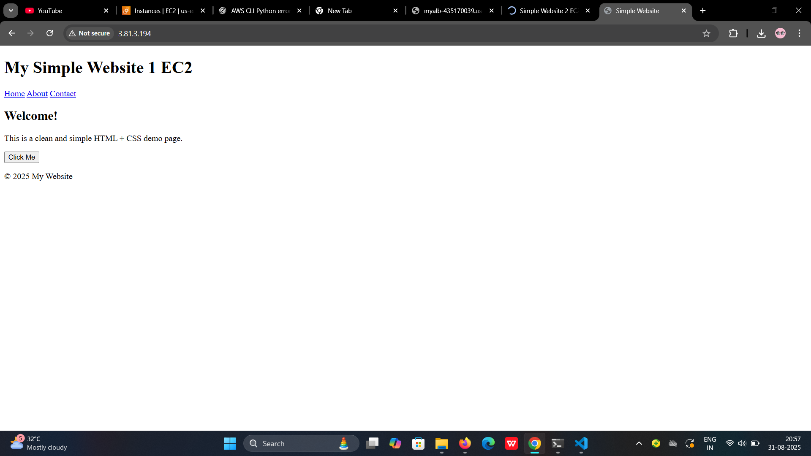

# Terraform AWS Project  
## Setting up Infrastructure on AWS using Terraform  

This project demonstrates how to provision AWS infrastructure using **Terraform**.  
The setup includes a **VPC, public subnets, EC2 instances, Load Balancer, Target Group, Internet Gateway, Route Table, and Amazon S3** integration.  

---

# Architecture Diagram  

  

---

#  Infrastructure Components  

#  VPC  
- CIDR block: `10.0.0.0/16`  
- Provides the networking foundation for all AWS resources.  

📸 **Screenshot:**  
  

---

# Public Subnets  
- Used to host EC2 instances.  
- Each subnet belongs to a different Availability Zone for **high availability**.  

📸 **Screenshot:**  
  

---

# EC2 Instances  
- Deployed in **multiple subnets** to ensure redundancy.  
- Configured with **security groups** and **key pairs**.  

📸 **Screenshot:**  
  

---

# Internet Gateway  
- Provides internet access to resources inside the VPC.  
- Route Table maps traffic from subnets to the Internet Gateway.  

📸 **Screenshot:**  
  

---

# Route Table  
- Defines how traffic is routed within the VPC.  

📸 **Screenshot:**  
  

---

# Target Group  
- Routes traffic to EC2 instances.  
- Ensures proper load distribution across multiple instances.  

📸 **Screenshot:**  
  

---

# Load Balancer  
- Distributes incoming traffic across EC2 instances.  
- Provides **scalability and high availability**.  

📸 **Screenshot:**  
  

---

#  Amazon S3  
- Used for storing application data.  
- Can also be configured as a backend for Terraform state.  

📸 **Screenshot:**  
  

---

## Terraform Outputs  

#  Load Balancer DNS  
After applying Terraform, you’ll get the **Load Balancer DNS**.  

📸 **Screenshot:**  
  
  

---

# EC2 Instance Public IPs  
Terraform also outputs the **public IPs** of the two instances.  

📸 **Screenshots:**  
  
  

---


## Deployment Steps

```bash
# Clone the repo
git clone https://github.com/your-username/aws-terraform-infra.git
cd aws-terraform-infra
```
# Initialize Terraform
```
terraform init
```
# Validate config
```
terraform validate
```
# Plan the infra
```
terraform plan
```
# Apply
```
terraform apply -auto-approve
```
# Destroy when not needed
```
terraform destroy -auto-approve
```
---
## How to Use

**Clone this repository**
   ```bash
   git clone https://github.com/your-username/aws-terraform-infra.git
   cd aws-terraform-infra
